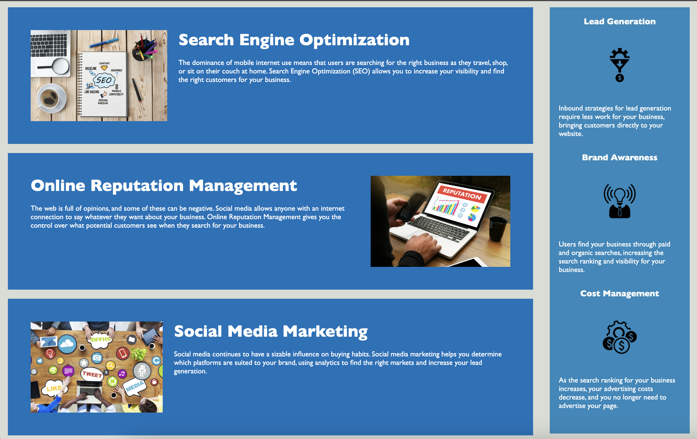
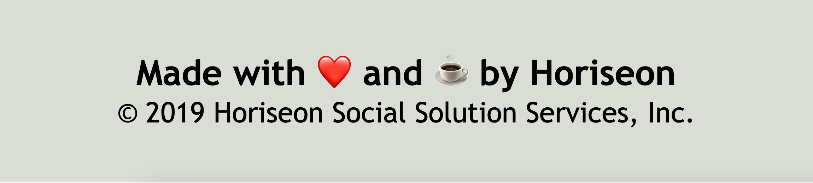
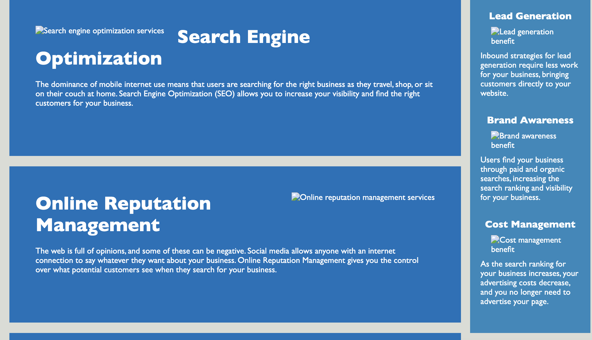

# Horiseon - Web Accessibility

[](code_of_conduct.md)

## The Repository

This repository is generated on behalf of Horiseon Social Solution Services, Inc. and contains improvements to the company webpage.  The existing code is refactored to enhance web accessibility and search engine visibility. 

> Nonsemantic html elements were replaced with semantic elements to add more concise structure and code readability.

>Image alts were applied to render images accessible to visitors with disabilities.

---

## Installation

The code may be accessed on [GitHub](https://github.com/choelzli/horiseon-access) or visiting the site URL.

Clone the repo:
```
git clone https://github.com/choelzli/horiseon-access.git
```

---

## Usage

Upon accessing the Horiseon webpage, it displays a navigation bar and header image.  


Clicking an item in the navigation bar directs the user to cards with additional information and images describing their services.  There is an aside element to the right with a card highlighting the benefits customers experience when using Horiseon.  These cards are also accessible by scrolling down the page.



At the bottom of the page is a footer that shows Horiseon's legal name and a wholesome shoutout to the dev team.


---
## Tests
To test the semantic html elements, open the webpage and inspect elements.  | To observe the image alts, break the img in html and refresh the page.
------------- | -------------
 | 

---

## License

Licensed under the MIT license.

---

## Credits

Base code developed and provided by Columbia Coding Bootcamp. Other sources include:
* [The Contributor Covenant](https://www.contributor-covenant.org/)
* [Display Table in README](https://stackoverflow.com/questions/39378020/how-to-display-table-in-readme-md-file-in-github)
* [MDN Web Docs: bdi](https://developer.mozilla.org/en-US/docs/Web/HTML/Element/bdi)
* [MDN Web Docs: figure](https://developer.mozilla.org/en-US/docs/Web/HTML/Element/figure)
* [MDN Web Docs: section](https://developer.mozilla.org/en-US/docs/Web/HTML/Element/section)
* [Professional README guide](https://coding-boot-camp.github.io/full-stack/github/professional-readme-guide)
* [README Template](https://github.com/othneildrew/Best-README-Template)
* [VS Code README](https://github.com/microsoft/vscode/tree/main)
